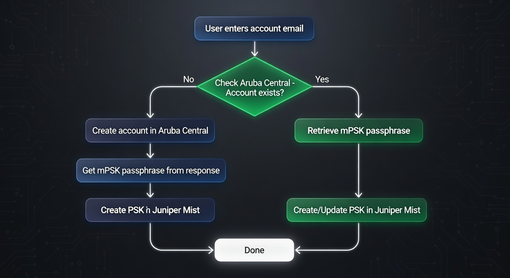

# Unified mPSK Sync Tool for Aruba Central and Juniper Mist

Simple web application for managing mPSK accounts across Aruba Central and Juniper Mist.

## Features

- **Web Interface**: Clean, Bootstrap 5 styled web interface
- **Authentication**: Simple username/password login (credentials from `APP_USERNAME` and `APP_PASSWORD` in `.env`)
- **PSK Management**: Create and sync PSK accounts between Aruba Central and Juniper Mist
- **Account Checking**: Automatically checks if accounts exist before creating
- **Details View**: Expandable accordion to view full API responses for debugging

## How it works

The app takes the account email you enter and syncs the corresponding mPSK with Aruba Central and Juniper Mist:



1. **Check Aruba Central** – Look up whether an account with that email already exists.
2. **If it exists** – Retrieve the mPSK passphrase and create or update the PSK in Juniper Mist.
3. **If it doesn’t exist** – Create the account in Aruba Central, get the generated mPSK passphrase, then create the PSK in Juniper Mist.

## Setup

### Environment Variables

Copy `.env.example` to `.env` and configure:

```bash
cp .env.example .env
```

All configuration is via environment variables (no hardcoded defaults). Set these in `.env`:

- `APP_USERNAME`: Web login username
- `APP_PASSWORD`: Web login password
- `ARUBA_BASE_URL`: Aruba Central API base URL
- `ARUBA_TOKEN`: Aruba Central access token
- `ARUBA_CLIENT_ID`: Aruba Central client ID (for token refresh)
- `ARUBA_CLIENT_SECRET`: Aruba Central client secret (for token refresh)
- `ARUBA_MPSK_NETWORK_ID`: Aruba Central mPSK network ID
- `ARUBA_USER_ROLE`: Aruba Central user role
- `MIST_BASE_URL`: Juniper Mist API base URL
- `MIST_TOKEN`: Juniper Mist API token
- `MIST_ORG_ID`: Juniper Mist organization ID
- `SSID`: SSID name
- `VLAN_ID`: VLAN ID (integer)

### Local Development

1. Install dependencies:
```bash
pip install -r requirements.txt
```

2. Set environment variables (create `.env` file or export them)

3. Run the application:
```bash
uvicorn main:app --host 0.0.0.0 --port 8000 --reload
```

4. Access the application at `http://localhost:8000`

### Docker

1. Build the Docker image:
```bash
docker build -t mpsk-integration .
```

2. Run the container:
```bash
docker run -d -p 8000:8000 --env-file .env mpsk-integration
```

Or with environment variables:
```bash
docker run -d -p 8000:8000 \
  -e APP_PASSWORD=your_password \
  -e ARUBA_TOKEN=your_token \
  -e MIST_TOKEN=your_token \
  ... \
  mpsk-integration
```

## Usage

1. Navigate to the application URL
2. Login with username `admin` and your configured password
3. Enter an email address in the form
4. Click "Create / Sync PSK"
5. View the PSK and details in the response

## API Endpoints

- `GET /`: Main page with form
- `POST /`: Process PSK creation/sync
- `GET /login`: Login page
- `POST /login`: Handle login

## Project Structure

```
.
├── main.py              # FastAPI application
├── templates/
│   ├── index.html       # Main form and results page
│   └── login.html       # Login page
├── requirements.txt     # Python dependencies
├── Dockerfile          # Docker configuration
├── .env.example        # Example environment variables
└── README.md           # This file
```

## Publish to GitHub

1. **Create a new repository** on GitHub: go to [github.com/new](https://github.com/new), set the name (e.g. `mPSK`), leave "Initialize with README" **unchecked**, then Create repository.

2. **Add your GitHub remote and push** (replace `YOUR_USERNAME` and `YOUR_REPO` with your GitHub username and repo name):

   ```bash
   git remote add origin https://github.com/YOUR_USERNAME/YOUR_REPO.git
   git push -u origin main
   ```

3. **(Optional)** Set your git identity for this repo, then amend the initial commit:

   ```bash
   git config user.name "Your Name"
   git config user.email "your@email.com"
   git commit --amend --reset-author --no-edit
   git push --force-with-lease
   ```

